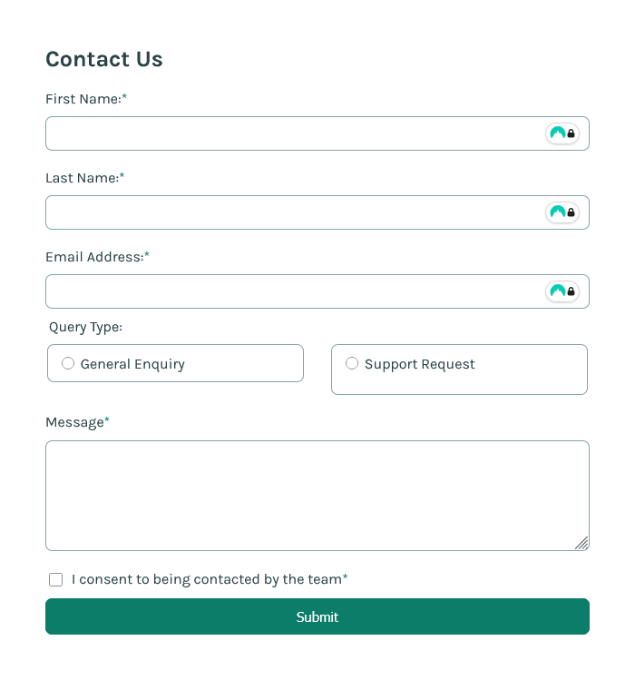

# Frontend Mentor - Contact form solution

This is a solution to the [Contact form challenge on Frontend Mentor](https://www.frontendmentor.io/challenges/contact-form--G-hYlqKJj). Frontend Mentor challenges help you improve your coding skills by building realistic projects.

## Table of contents

- [Overview](#overview)
  - [The challenge](#the-challenge)
  - [Screenshot](#screenshot)
  - [Links](#links)
- [My process](#my-process)
  - [Built with](#built-with)
  - [What I learned](#what-i-learned)
  - [Useful resources](#useful-resources)
- [Author](#author)

## Overview

### The challenge

Users should be able to:

- Complete the form and see a success toast message upon successful submission - DONE
- Receive form validation messages if:
  - A required field has been missed
  - The email address is not formatted correctly
- Complete the form only using their keyboard
- Have inputs, error messages, and the success message announced on their screen reader
- View the optimal layout for the interface depending on their device's screen size - WIP
- See hover and focus states for all interactive elements on the page

### Screenshot



### Links

- Solution URL: [Repo Link](https://github.com/cguttweb/Frontend-Mentor-Challenges-2025/tree/main/contact-form-main)
- Live Site URL: [Add live site URL here](https://your-live-site-url.com)

## My process

I started with the HTML and CSS styling on mobile for mobile-first before then starting on the javascript for the form validation.

### Built with

- Semantic HTML5 markup
- Mobile-first workflow
- CSS custom properties (CSS variables)
- Flexbox

### What I learned

How the use of helper functions can streamline code to help keep things DRY e.g.

```js
function setError(selector, show) {
  const el = document.querySelector(selector);
  if (el) {
    el.style.display = show ? 'block' : 'none';
  }
}
```

### Useful resources

- [MDN - Client Side Form Validation](https://developer.mozilla.org/en-US/docs/Learn_web_development/Extensions/Forms/Form_validation) - I knew some basics but I learnt about further built-in form validation e.g. pattern for regex matching

## Author

- Website - [portfolio](https://www.cgweb.co.uk)
- Frontend Mentor - [@cguttweb](https://www.frontendmentor.io/profile/cguttweb)
